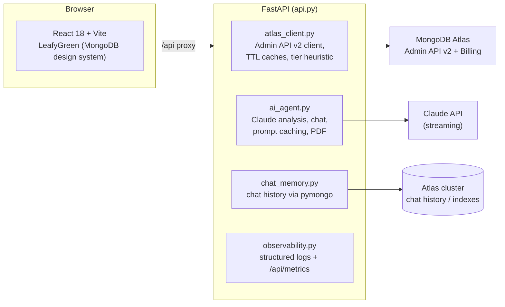

# Torre — Atlas Control Plane


> The user interface is in Brazilian Portuguese (pt-BR) by design — Torre was built for a Brazilian audience. Source code, comments, and documentation are in English.

## The problem

If you operate more than a handful of MongoDB Atlas clusters, you know the drill. The answer to "how is the fleet doing?" is scattered across a dozen browser tabs: one project for the invoice, another for the Performance Advisor, a third for the Query Profiler, a metrics page per cluster. When someone asks *"should we scale the payments cluster?"* or *"why did the bill go up this month?"*, assembling the answer is twenty minutes of clicking — and the person asking usually needed it five minutes ago.

Atlas already exposes everything you need through its Admin API v2. What's missing is a single pane of glass that pulls it together — and, ideally, something that can *reason* about it with you.

## The solution

Torre is that pane of glass: an operational dashboard for a whole Atlas fleet, with a Claude assistant sitting on top of the **real** data. Not a chatbot with generic MongoDB trivia — a chat grounded in the actual clusters, their actual slow queries, their actual 24-hour CPU curves. Ask it whether an M30 is enough, and it answers from the p95 CPU of *your* cluster, not from a blog post.

One backend, one screen, nine views:

| Page | What it shows |
|------|---------------|
| **Overview** | Fast static snapshot of the fleet: clusters, status, cost, and alerts. |
| **Clusters** | Every cluster in the org with tier, region, status, and estimated cost. |
| **Performance Advisor** | Suggested indexes, one-click execution via pymongo, Claude analysis, and a PDF report. |
| **Query Profiler** | Parsed slow queries (plan, COLLSCAN, docs examined, latency), with a real `explain('executionStats')`. |
| **Health Score** | A 0–100 score combining Performance Advisor, COLLSCAN shapes, status, and version. |
| **Scale** | Tier recommendation from 24h CPU (p95/avg), memory, storage, and connections, plus native auto-scaling status. |
| **FinOps** | Current invoice (Billing API) plus estimated cost vs. 24h utilization per cluster. |
| **Compare** | Two clusters side by side. |
| **AI Chat** | Streaming Claude chat grounded in real cluster context, with history persisted in Atlas. |

## Architecture



A few deliberate choices:

- **Credentials never leave the backend.** The frontend talks only to `/api`; Atlas and Anthropic keys live in `.env` on the server side.
- **The assistant is fenced in.** The system prompt restricts scope to MongoDB Atlas (an "M30" is an Atlas tier, never a Kubernetes cluster) and forbids inventing metrics — it must distinguish *real API data* from *pattern-based recommendation*.
- **It's cheap to keep open.** A reused HTTP session and module-level TTL caches keep Atlas API round-trips down, and Anthropic prompt caching (static system block + a ~2-minute cluster-context snapshot) keeps repeat chat turns from re-billing the same tokens. Token spend is visible at `GET /api/metrics`.

## Getting started

### Prerequisites

Python 3.10+, Node 18+, a MongoDB Atlas account with an [Admin API key](https://www.mongodb.com/docs/atlas/configure-api-access/), and an Anthropic API key.

### 1. Configure the environment

```bash
cp .env.example .env   # then fill in your keys
```

```env
ATLAS_PUBLIC_KEY=<your-atlas-public-key>
ATLAS_PRIVATE_KEY=<your-atlas-private-key>
ATLAS_ORG_ID=<your-atlas-org-id>
ANTHROPIC_API_KEY=<your-anthropic-key>
MONGODB_URI=<mongodb+srv://...>        # optional: index creation and chat history
CLAUDE_MODEL=claude-sonnet-5           # optional: defaults to Sonnet 5
API_AUTH_TOKEN=<optional-bearer-token> # optional: protects the API
```

### 2. Run

```bash
./run_react.sh
```

The script activates the virtualenv, installs dependencies if needed, finds free ports, and starts backend and frontend together. URLs are printed to the terminal. Defaults are 8765 (API) and 5290 (UI); override with `API_PORT=8770 WEB_PORT=5295 ./run_react.sh`.

### 3. Test

```bash
python -m unittest discover -s tests -v
```

24 pure-logic tests (scaling heuristic, injection guards, chat-memory id validation) — no Atlas or Mongo credentials required.

### Docker

One container: nginx serves the frontend build and proxies `/api` to FastAPI.

```bash
docker build -t torre .
docker run --env-file .env -p 8080:8080 torre
```

## Project layout

```
torre/
├── api.py                # FastAPI backend; all REST routes, middleware, auth
├── atlas_client.py       # Atlas Admin API v2 client + scaling recommendations
├── ai_agent.py           # Claude analysis, chat, PDF generation (streaming)
├── chat_memory.py        # Chat history persisted in Atlas (pymongo)
├── observability.py      # Structured logging + in-process metrics
├── populate_workload.py  # Seed demo workload data
├── populate_profiler.py  # Seed demo profiler data
├── tests/                # unittest suite (no credentials needed)
├── run_react.sh          # Starts backend + frontend on free ports
├── Dockerfile, nginx.conf
└── frontend/             # React 18 + Vite + LeafyGreen
    ├── src/api.js         # Axios client and streaming
    ├── src/App.jsx        # Shell and navigation
    └── src/pages/         # One component per page
```

## Credits

Torre is based on Maestro, originally created by [Carime](https://github.com/carimeb) ([maestro-atlas-landing-zone](https://github.com/carimeb/maestro-atlas-landing-zone)). Thanks to her for the foundation.

## License

MIT. See [LICENSE](LICENSE).
